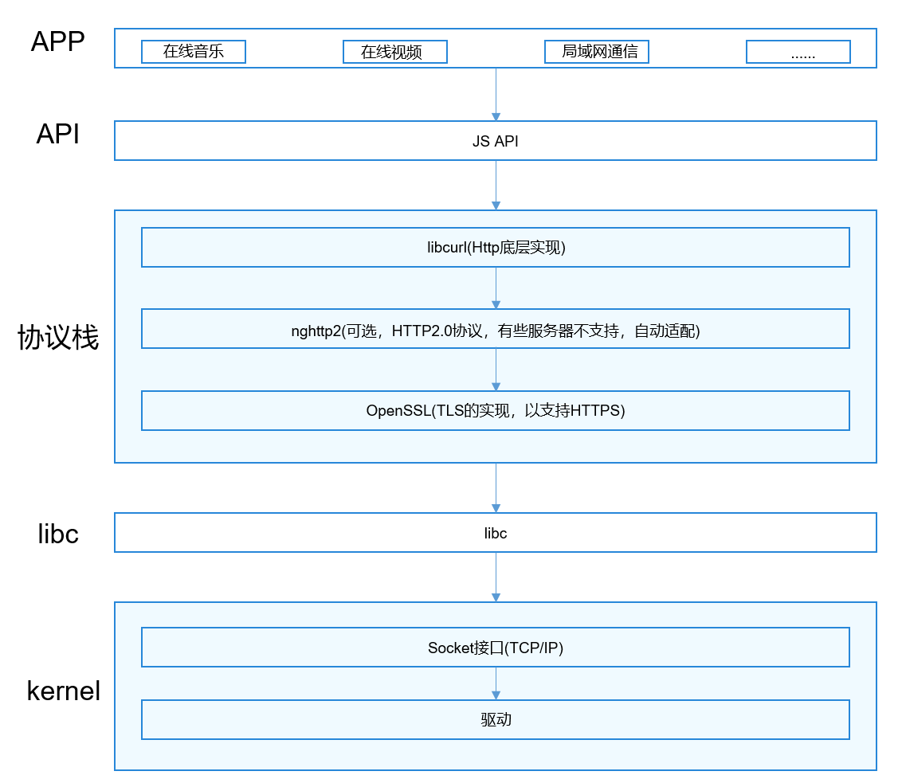
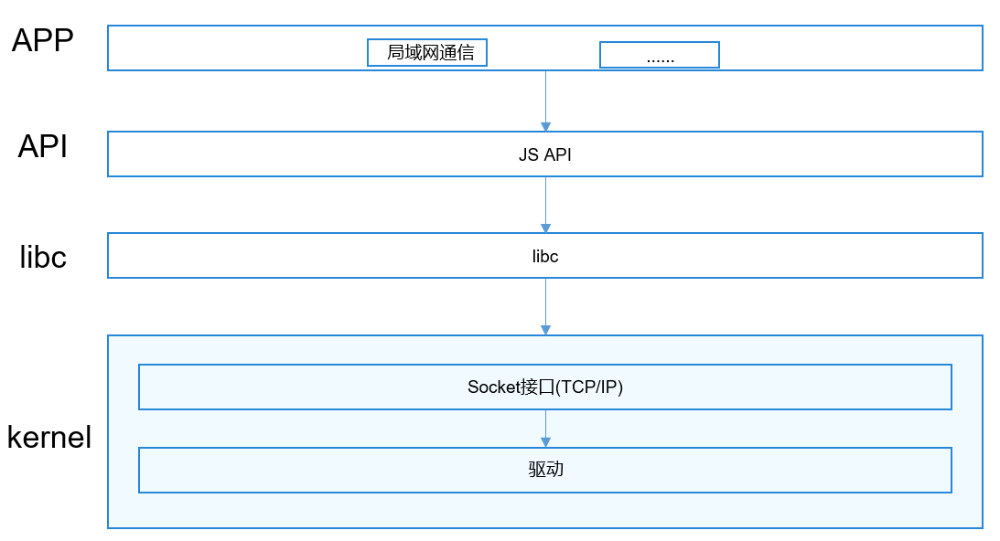

# Net Manager

## 简介

网络协议栈介绍：

    网络协议栈模块作为电话子系统可裁剪部件，主要分为HTTP和socket模块；如图1：Http接口架构图；如图2：socket接口架构图；

**图 1**  Http接口架构图



**图 2**  socket接口架构图



## 目录

```
/foundation/communication/netstack
├─figures                            # 架构图
├─frameworks                         # API实现
│  └─js                              # JS API实现
│      ├─builtin                     # 小型系统JS API实现
│      └─napi                        # 标准系统JS API实现
│          ├─http                    # http API
│          ├─socket                  # socket API
│          └─websocket               # websocket API
├─interfaces                         # JS 接口定义
├─test                               # 测试
└─utils                              # 工具
```

## 接口说明

### Http接口说明

| 类型 | 接口 | 功能说明 |
| ---- | ---- | ---- |
| ohos.net.socket | function createHttp(): HttpRequest | 返回一个HttpRequest对象 |
| ohos.net.http.HttpRequest | on(type: "headerReceive", callback: AsyncCallback\<Object>): void | 监听收到Http头的事件 |
| ohos.net.http.HttpRequest | once(type: "headerReceive", callback: Callback\<Object>): void | 监听收到Http头的事件，只监听一次 |
| ohos.net.http.HttpRequest | off(type: "headerReceive", callback: AsyncCallback\<Object>): void | 取消监听收到Http头的事件 |
| ohos.net.http.HttpRequest | on(type: "headerReceive", callback: Callback\<Object>): void | 监听收到Http头的事件 |
| ohos.net.http.HttpRequest | once(type: "headerReceive", callback: Callback\<Object>): void | 监听收到Http头的事件，只监听一次 |
| ohos.net.http.HttpRequest | off(type: "headerReceive", callback: Callback\<Object>): void | 取消监听收到Http头的事件 |
| ohos.net.http.HttpRequest | request(url: string, callback: AsyncCallback\<[HttpResponse](#httpresponse)>): void | 用**GET**方法请求一个域名，调用callback |
| ohos.net.http.HttpRequest | request(url: string, options: [HttpRequestOptions](#httprequestoptions), callback: AsyncCallback\<[HttpResponse](#httpresponse)>): void | 请求一个域名，options中携带请求参数，调用callback |
| ohos.net.http.HttpRequest | request(url: string, options?: [HttpRequestOptions](#httprequestoptions): Promise\<[HttpResponse](#httpresponse)> | 请求一个域名，options中携带请求参数(可选)，返回Promise |

#### HttpRequestOptions

##### method

- string类型，支持的方法
    - **OPTIONS**
    - **GET**
    - **HEAD**
    - **POST**
    - **PUT**
    - **DELETE**
    - **TRACE**
    - **CONNECT**

##### extraData

- 请求方法是 **OPTIONS** ,  **GET** ,  **HEAD** ,  **DELETE**, **TRACE**或者**CONNECT**
    - extraData类型是string
        - extraData字段会直接与url进行拼接，也就是将extraData当作url的参数，不会进行URL编码，URL编码由开发者自行完成
    - extraData类型是Object
        - Object会被解析成"name1=value1&name2=value2"这样的url参数，仅对类型是string的字段进行解析
    - 举例：
        - url = "https://www.example.com"<br>extraData = "name=Tony&age=20"
          <br>那么最终的请求发出去时的url就是: "https://www.example.com?name=Tony&age=20"
        - url = "https://www.example.com?type=animal"<br>extraData = "name=Tony&age=20"
          <br>那么最终的请求发出去时的url就是: "https://www.example.com?type=animal&name=Tony&age=20"
        - url = "https://www.example.com?type=animal"<br>extraData = {"name": "Tony", "age": "20"}
          <br>那么最终的请求发出去时的url就是: "https://www.example.com?type=animal&name=Tony&age=20"
        - url = "https://www.example.com?type=animal"
          <br>extraData = {"name": "Tony", "age": "20", "any": {"country": "China"}}
          <br>那么最终的请求发出去时的url就是: "https://www.example.com?type=animal&name=Tony&age=20"
          <br>忽略"any"字段，因为其类型不是string
- 请求方法是 **POST** 或者 **PUT**
    - 直接当作Http报文的body部分

##### header

- 如下形式的Object

```json
{
  "name1": "value1",
  "name2": "value2",
  "name3": "value3"
}
```

##### readTimeout

number类型，总超时时间，单位毫秒，默认60000ms

##### connectTimeout

number类型，连接超时时间，单位毫秒，默认60000ms

#### HttpResponse

##### result

- result字段是Http的响应体，目前只支持string和ArrayBuffer类型有响应头中的content-type决定。
    - 如果content-type是**application/octet-stream**，类型为ArrayBuffer
    - 其他情况下为string

##### responseCode

- responseCode为ResponseCode类型，有以下值
    - OK = 200
    - CREATED = 201
    - ACCEPTED = 202
    - NOT_AUTHORITATIVE = 203
    - NO_CONTENT = 204
    - RESET = 205
    - PARTIAL = 206
    - MULT_CHOICE = 300
    - MOVED_PERM = 301
    - MOVED_TEMP = 302
    - SEE_OTHER = 303
    - NOT_MODIFIED = 304
    - USE_PROXY = 305
    - BAD_REQUEST = 400
    - UNAUTHORIZED = 401
    - PAYMENT_REQUIRED = 402
    - FORBIDDEN = 403
    - NOT_FOUND = 404
    - BAD_METHOD = 405
    - NOT_ACCEPTABLE = 406
    - PROXY_AUTH = 407
    - CLIENT_TIMEOUT = 408
    - CONFLICT = 409
    - GONE = 410
    - LENGTH_REQUIRED = 411
    - PRECON_FAILED = 412
    - ENTITY_TOO_LARGE = 413
    - REQ_TOO_LONG = 414
    - UNSUPPORTED_TYPE = 415
    - INTERNAL_ERROR = 500
    - NOT_IMPLEMENTED = 501
    - BAD_GATEWAY = 502
    - UNAVAILABLE = 503
    - GATEWAY_TIMEOUT = 504
    - VERSION = 505

##### header

- 如下形式的Object

```json
{
  "name1": "value1",
  "name2": "value2",
  "name3": "value3"
}
```

##### cookies

- string类型的字段，需要开发者自行解析

#### 示例

```javascript
import http from "@ohos.net.http"
let httpRequest = http.createHttp()
httpRequest.request("www.example.com", function (err, data) {
    console.log(JSON.stringify(err))
    console.log(JSON.stringify(data))
})
```

### socket接口说明

| 类型 | 接口 | 功能说明 |
| ---- | ---- | ---- |
| ohos.net.socket | function constructUDPSocketInstance(): UDPSocket | 返回一个UDPSocket对象 |
| ohos.net.socket | function constructUDPSocketInstance(): TCPSocket | 返回一个TCPSocket对象 |
| ohos.net.socket.UDPSocket | bind(address: [NetAddress](#netaddress), callback: AsyncCallback\<void>): void | 绑定IP地址和端口，端口可以指定或由系统随机分配。使用callback方式作为异步方法。 |
| ohos.net.socket.UDPSocket | bind(address: [NetAddress](#netaddress)): Promise\<void> | 绑定IP地址和端口，端口可以指定或由系统随机分配。使用Promise方式作为异步方法。 |
| ohos.net.socket.UDPSocket | send(options: [UDPSendOptions](#udpsendoptions), callback: AsyncCallback\<void>): void | 通过UDPSocket连接发送数据。使用callback方式作为异步方法。 |
| ohos.net.socket.UDPSocket | send(options: [UDPSendOptions](#udpsendoptions)): Promise\<void> | 通过UDPSocket连接发送数据。使用Promise方式作为异步方法。 |
| ohos.net.socket.UDPSocket | close(callback: AsyncCallback\<void>): void | 关闭UDPSocket连接。使用callback方式作为异步方法。 |
| ohos.net.socket.UDPSocket | close(): Promise\<void> | 关闭UDPSocket连接。使用Promise方式作为异步方法。 |
| ohos.net.socket.UDPSocket | getState(callback: AsyncCallback\<[SocketStateBase](#socketstatebase)>): void | 获取UDPSocket状态。使用callback方式作为异步方法。 |
| ohos.net.socket.UDPSocket | getState(): Promise\<[SocketStateBase](#socketstatebase)> | 获取UDPSocket状态。使用Promise方式作为异步方法。 |
| ohos.net.socket.UDPSocket | setExtraOptions(options: [UDPExtraOptions](#udpextraoptions), callback: AsyncCallback\<void>): void | 设置UDPSocket连接的其他属性。使用callback方式作为异步方法。 |
| ohos.net.socket.UDPSocket | setExtraOptions(options: [UDPExtraOptions](#udpextraoptions)): Promise\<void> | 设置UDPSocket连接的其他属性。使用Promise方式作为异步方法。 |
| ohos.net.socket.UDPSocket | on(type: 'message', callback: Callback\<{message: ArrayBuffer, remoteInfo: [SocketRemoteInfo](#socketremoteinfo)}>): void | 订阅UDPSocket连接的接收消息事件。使用callback方式作为异步方法。 |
| ohos.net.socket.UDPSocket | off(type: 'message', callback?: Callback\<{message: ArrayBuffer, remoteInfo: [SocketRemoteInfo](#socketremoteinfo)}>): void | 取消订阅UDPSocket连接的接收消息事件。使用callback方式作为异步方法。 |
| ohos.net.socket.UDPSocket | on(type: 'listening' &#124; 'close', callback: Callback\<void>): void | 订阅UDPSocket连接的数据包消息事件或关闭事件。使用callback方式作为异步方法。 |
| ohos.net.socket.UDPSocket | off(type: 'listening' &#124; 'close', callback?: Callback\<void>): void | 取消订阅UDPSocket连接的数据包消息事件或关闭事件。使用callback方式作为异步方法。 |
| ohos.net.socket.UDPSocket | on(type: 'error', callback?: ErrorCallback): void | 订阅UDPSocket连接的error事件。使用callback方式作为异步方法。 |
| ohos.net.socket.UDPSocket | off(type: 'error', callback?: ErrorCallback): void | 取消订阅UDPSocket连接的error事件。使用callback方式作为异步方法。 |
| ohos.net.socket.TCPSocket | bind(address: [NetAddress](#netaddress), callback: AsyncCallback\<void>): void | 绑定IP地址和端口，端口可以指定或由系统随机分配。使用callback方法作为异步方法。 |
| ohos.net.socket.TCPSocket | bind(address [NetAddress](#netaddress)): Promise\<void> | 绑定IP地址和端口，端口可以指定或由系统随机分配。使用Promise方法作为异步方法。 |
| ohos.net.socket.TCPSocket | connect(options: [TCPConnectOptions](#tcpconnectoptions), callback: AsyncCallback\<void>): void | 连接到指定的IP地址和端口。使用callback方法作为异步方法。 |
| ohos.net.socket.TCPSocket | connect(options: [TCPConnectOptions](#tcpconnectoptions)): Promise\<void> | 连接到指定的IP地址和端口。使用Promise方法作为异步方法。 |
| ohos.net.socket.TCPSocket | send(options: [TCPSendOptions](#tcpsendoptions), callback: AsyncCallback\<void>): void | 通过TCPSocket连接发送数据。使用callback方式作为异步方法。 |
| ohos.net.socket.TCPSocket | send(options: [TCPSendOptions](#tcpsendoptions)): Promise\<void> | 通过TCPSocket连接发送数据。使用Promise方式作为异步方法。 |
| ohos.net.socket.TCPSocket | close(callback: AsyncCallback\<void>): void | 关闭TCPSocket连接。使用Promise方式作为异步方法。 |
| ohos.net.socket.TCPSocket | close(): Promise\<void> | 关闭TCPSocket连接。使用Promise方式作为异步方法。 |
| ohos.net.socket.TCPSocket | getRemoteAddress(callback: AsyncCallback\<[NetAddress](#netaddress)>): void | 获取对端Socket地址。使用callback方式作为异步方法。 |
| ohos.net.socket.TCPSocket | getRemoteAddress(): Promise\<[NetAddress](#netaddress)> | 获取对端Socket地址。使用Promise方式作为异步方法。 |
| ohos.net.socket.TCPSocket | getState(callback: AsyncCallback\<[SocketStateBase](#socketstatebase)>): void | 获取TCPSocket状态。使用callback方式作为异步方法。 |
| ohos.net.socket.TCPSocket | getState(): Promise\<[SocketStateBase](#socketstatebase)> | 获取TCPSocket状态。使用Promise方式作为异步方法。 |
| ohos.net.socket.TCPSocket | setExtraOptions(options: [TCPExtraOptions](#tcpextraoptions), callback: AsyncCallback<void>): void | 设置TCPSocket连接的其他属性。使用callback方式作为异步方法。 |
| ohos.net.socket.TCPSocket | setExtraOptions(options: [TCPExtraOptions](#tcpextraoptions)): Promise<void> | 设置TCPSocket连接的其他属性。使用Promise方式作为异步方法。 |
| ohos.net.socket.TCPSocket | on(type: 'message', callback: Callback<{message: ArrayBuffer, remoteInfo: [SocketRemoteInfo](#socketremoteinfo)}>): void | 订阅TCPSocket连接的接收消息事件。使用callback方式作为异步方法。 |
| ohos.net.socket.TCPSocket | off(type: 'message', callback: Callback<{message: ArrayBuffer, remoteInfo: [SocketRemoteInfo](#socketremoteinfo)}>): void | 取消订阅TCPSocket连接的接收消息事件。使用callback方式作为异步方法。 |
| ohos.net.socket.TCPSocket | on(type: 'connect' &#124; 'close', callback: Callback<void>): void | 订阅TCPSocket的连接事件或关闭事件。使用callback方式作为异步方法。 |
| ohos.net.socket.TCPSocket | off(type: 'connect' &#124; 'close', callback: Callback<void>): void | 取消订阅TCPSocket的连接事件或关闭事件。使用callback方式作为异步方法。 |
| ohos.net.socket.TCPSocket | on(type: 'error', callback?: ErrorCallback): void | 订阅TCPSocket连接的error事件。使用callback方式作为异步方法。 |
| ohos.net.socket.TCPSocket | off(type: 'error', callback?: ErrorCallback): void | 取消订阅TCPSocket连接的error事件。使用callback方式作为异步方法。 |


#### NetAddress

目标地址信息。

| 参数名  | 类型   | 必填 | 说明                                                         |
| ------- | ------ | ---- | ------------------------------------------------------------ |
| address | string | 是   | 本地绑定的ip地址。                                           |
| port    | number | 否   | 端口号 ，范围0~65535。如果不指定系统随机分配端口。           |
| family  | number | 否   | 网络协议类型，可选类型：<br />- 1：IPv4<br />- 2：IPv6<br />默认为1。 |

#### UDPSendOptions

UDPSocket发送参数。

| 参数名  | 类型                               | 必填 | 说明           |
| ------- | ---------------------------------- | ---- | -------------- |
| data    | string                             | 是   | 发送的数据。   |
| address | [NetAddress](#netaddress) | 是   | 目标地址信息。 |

#### UDPExtraOptions

UDPSocket连接的其他属性。

| 参数名            | 类型    | 必填 | 说明                             |
| ----------------- | ------- | ---- | -------------------------------- |
| broadcast         | boolean | 否   | 是否可以发送广播。默认为false。  |
| receiveBufferSize | number  | 否   | 接收缓冲区大小（单位：Byte）。   |
| sendBufferSize    | number  | 否   | 发送缓冲区大小（单位：Byte）。   |
| reuseAddress      | boolean | 否   | 是否重用地址。默认为false。      |
| socketTimeout     | number  | 否   | 套接字超时时间，单位毫秒（ms）。 |

#### SocketStateBase

Socket的状态信息。

| 参数名      | 类型    | 必填 | 说明       |
| ----------- | ------- | ---- | ---------- |
| isBound     | boolean | 是   | 是否绑定。 |
| isClose     | boolean | 是   | 是否关闭。 |
| isConnected | boolean | 是   | 是否连接。 |

#### SocketRemoteInfo

Socket的连接信息。

| 参数名  | 类型   | 必填 | 说明                                                         |
| ------- | ------ | ---- | ------------------------------------------------------------ |
| address | string | 是   | 本地绑定的ip地址。                                           |
| family  | string | 是   | 网络协议类型，可选类型：<br />- IPv4<br />- IPv6<br />默认为IPv4。 |
| port    | number | 是   | 端口号，范围0~65535。                                        |
| size    | number | 是   | 服务器响应信息的字节长度。                                   |

#### TCPConnectOptions

TCPSocket连接的参数。

| 参数名  | 类型                               | 必填 | 说明                       |
| ------- | ---------------------------------- | ---- | -------------------------- |
| address | [NetAddress](#netaddress) | 是   | 绑定的地址以及端口。       |
| timeout | number                             | 否   | 超时时间，单位毫秒（ms）。 |

#### TCPSendOptions

TCPSocket发送请求的参数。

| 参数名   | 类型   | 必填 | 说明                                                         |
| -------- | ------ | ---- | ------------------------------------------------------------ |
| data     | string | 是   | 发送的数据。                                                 |
| encoding | string | 否   | 字符编码(UTF-8，UTF-16BE，UTF-16LE，UTF-16，US-AECII，ISO-8859-1)，默认为UTF-8。 |

#### TCPExtraOptions

TCPSocket连接的其他属性。

| 参数名            | 类型    | 必填 | 说明                                                         |
| ----------------- | ------- | ---- | ------------------------------------------------------------ |
| keepAlive         | boolean | 否   | 是否保持连接。默认为false。                                  |
| OOBInline         | boolean | 否   | 是否为OOB内联。默认为false。                                 |
| TCPNoDelay        | boolean | 否   | TCPSocket连接是否无时延。默认为false。                       |
| socketLinger      | Object  | 是   | socket是否继续逗留。<br />- on：是否逗留（true：逗留；false：不逗留）。<br />- linger：逗留时长，单位毫秒（ms），取值范围为0~65535。<br />当入参on设置为true时，才需要设置。 |
| receiveBufferSize | number  | 否   | 接收缓冲区大小（单位：Byte）。                               |
| sendBufferSize    | number  | 否   | 发送缓冲区大小（单位：Byte）。                               |
| reuseAddress      | boolean | 否   | 是否重用地址。默认为false。                                  |
| socketTimeout     | number  | 否   | 套接字超时时间，单位毫秒（ms）。                             |

## 相关仓

[网络管理子系统](https://gitee.com/openharmony/docs/blob/master/zh-cn/readme/%E7%BD%91%E7%BB%9C%E7%AE%A1%E7%90%86%E5%AD%90%E7%B3%BB%E7%BB%9F.md)

**communication_netstack**

[communication_netmanager_base](https://gitee.com/openharmony/communication_netmanager_base)

[communication_netmanager_ext](https://gitee.com/openharmony/communication_netmanager_ext)
