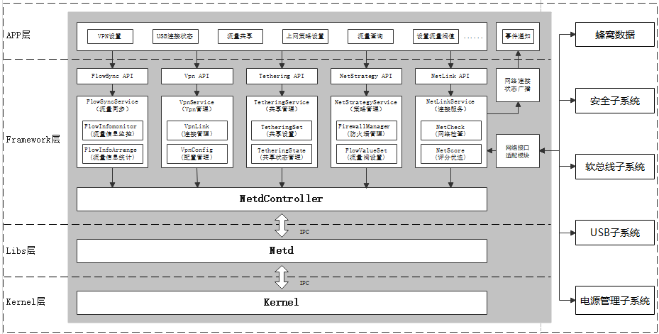

# Net Manager<a name="EN-US_TOPIC_0000001105058232"></a>

-    [简介](#section112mcpsimp)
-    [目录](#section125mcpsimp)
-    [约束](#section133mcpsimp)
-    [相关仓](#section155mcpsimp)


## 简介

网络管理介绍：

​    网络管理模块作为电话子系统可裁剪部件，依赖于蜂窝数据管理，主要分为连接管理、策略管理、流量管理、网络共享、VPN管理五大模块；如图1：网络管理架构图；

**图 1**  网络管理架构图



连接管理介绍：

​    负责与蜂窝数据交互，请求到IP后，再与Netd交互并将路由参数设置到内核，使得蜂窝数据连接且可用，最终实现上网，如图2：网络连接架构图；

**图  2**  网络连接架构图


## 目录

```
/foundation/communication/netstack/http/netstack/http/
├── frameworks                         # 框架代码
│   ├── innerkitsimpl                  # 内部接口实现
│   │   └── netconnmanager
│   │       └── src
│   └── js                             # JS接口实现
│       └── napi
│           ├── http
│           ├── socket
│           └── websocket
├── interfaces                         # 接口代码
│   ├── innerkits                      # 内部接口
│   │   └── native
│   │       └── netconnmanager
│   │           └── include
│   └── kits                           # 外部接口
│       └── js
├── sa_profile                         # 服务配置文件
├── services                           # 核心服务代码目录
│   ├── common                         # 网络管理公共组件
│   ├── etc                            # 网络管理进程配置脚本
│   │   └── init
│   ├── netconnmanager                 # 连接管理代码
│   │   ├── include                    # 头文件
│   │   │   ├── ipc                    # IPC通信头文件
│   │   │   ├── net_controller         # 网络控制
│   │   ├── src                        # 源文件目录
│   │   │   ├── ipc                    # IPC通信源文件
│   │   │   ├── net_controller         # 网络控制实现
│   │   └── test                       # 单元测试代码
│   ├── netmanagernative               # Netd代码
│   └── prebuild                       # 预编译库文件
└── utils                              # 公共功能实现
|   └── log                            # 日志实现
└── ohos.build                         # 编译文件
```

## 约束

-    开发语言：C++
-    软件层，需要以下子系统和服务配合使用：蜂窝数据、安全子系统、软总线子系统、USB子系统、电源管理子系统等；
-    硬件层，需要搭载的设备支持以下硬件：可以进行独立蜂窝通信的Modem以及SIM卡；

## 相关仓

[netmanager_standard](https://gitee.com/openharmony/communication_netmanager_standard/blob/master/README.md)

[电话服务子系统](https://gitee.com/openharmony/docs/blob/master/zh-cn/readme/%E7%94%B5%E8%AF%9D%E6%9C%8D%E5%8A%A1%E5%AD%90%E7%B3%BB%E7%BB%9F.md)

[ telephony_cellular_data](https://gitee.com/openharmony/telephony_cellular_data/blob/master/README.md)

